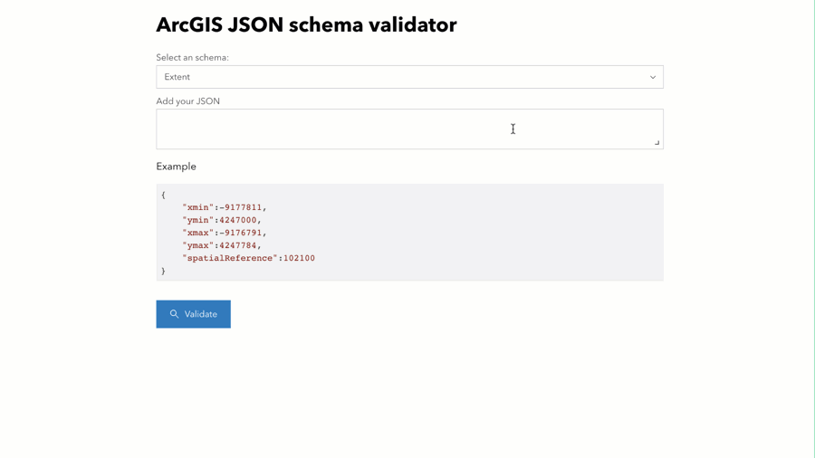

# ArcGISJSON Linter
This repository provides tools for building JSON Schema docs for ArcGISJSON. A schema is generated for each of the ArcGISJSON object types

[Parser](./index.html)
[REST API](./rest-api.html)

See JSON Schema docs for the GeoJSON types below:

-   [Extent](./extent.schema.json)
-   [SpatialReference](./spatial.reference.schema.json)

# Ideas

- [ ] Make each individual doc is complete (without $refs to other documents). So applications can consume just what they need and avoid extra fetching. Like [GeooJSON schema repo](https://github.com/geojson/schema).
- [ ] Like [geojson/schema](https://github.com/geojson/schema) publish the schemas at: arcgisjson.org/schema/Extent.json
- [ ] Make a plugin to VS Code to validate schemas from the IDE (and DevTools?)
